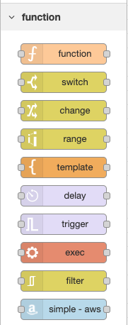
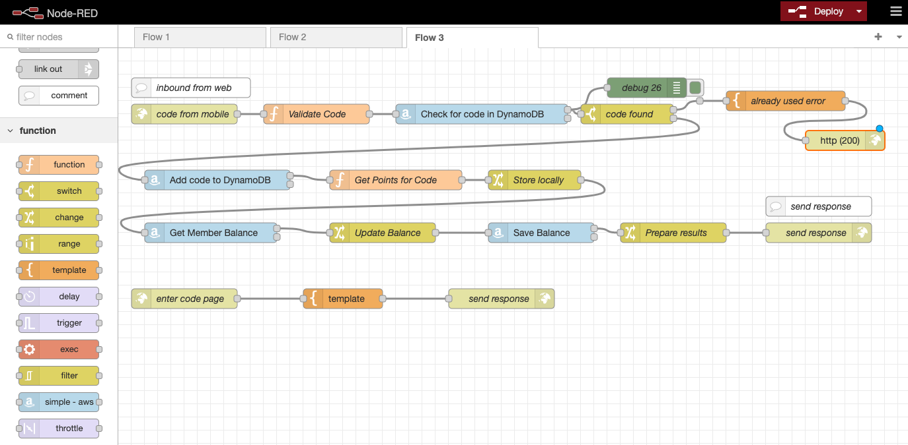
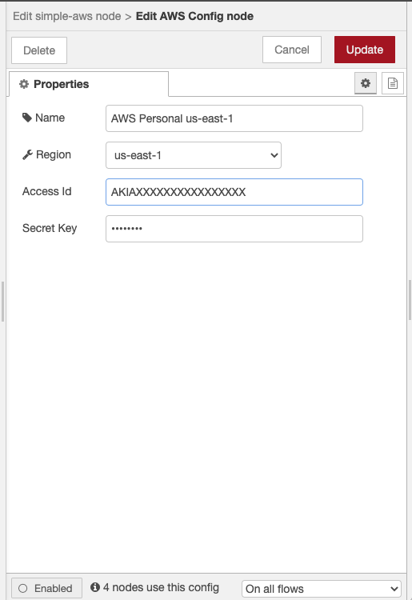
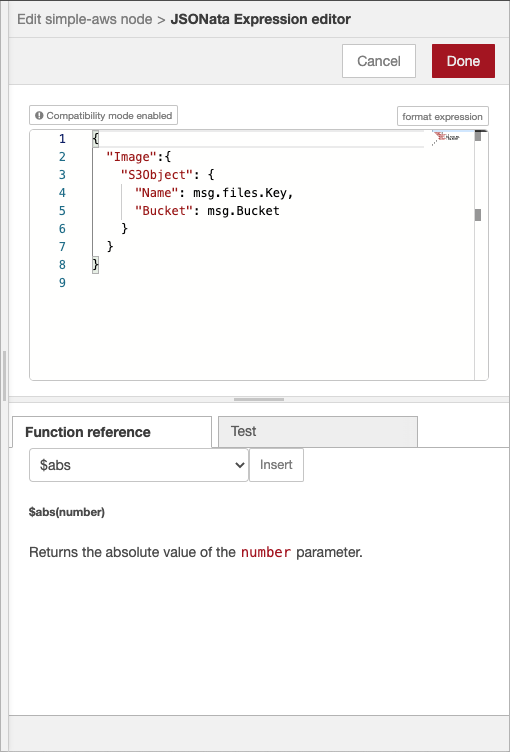

# Overview
Node Red Contrib Simple AWS is a Node Red node that gives developers access to the entirety of the Amazon Web Services SDK. Because the AWS SDK has a common format for handling configuration, versioning, requests, and responses, building a simple Node Red wrapper for all services is straighforward.

# Installation Using the Editor
You can install nodes directly within the editor by selecting the Manage Palette option from the main menu to open the Palette Manager.

The 'Nodes' tab lists all of the modules you have installed. It shows which you are using and whether updates are available for any of them.

The 'Install' tab lets you search the catalogue of available node modules and install them.

# Installing with npm
To install a node module from the command-line, you can use the following command from within your user data directory (by default, $HOME/.node-red):
````
npm install node-red-contrib-simple-aws
````
You will then need to restart Node-RED for it to pick-up the new nodes.

# Basic operation
There is a single node for all AWS Services and it is available in the Function category of the palette, as shown below. Drag the simple aws node onto your flow.

Once the node is in the flow it will look something like this.

You can then configure the properties of the node the way you would with any other node.

The **AWS Config** property gives you a way to configure your region and credentials as you can see below. Each instance of the node can have a different set of credentials and run in different regions so it gives you a lot of flexibility.

The **Name** parameter is optional and gives you the ability to give it a more descriptive name. The label will default to the service and operation you choose and I find that the default label works best 95% of the time.

## Parameters

### Service
The **Service** parameter is for the service that you want to choose such as S3, DynamoDB, or Rekognition.

### API Version
The **API Version** is important and gives you the ability to lock down the API version. Sometimes AWS can change this as the service evolves and without this setting, it could break your flow.

### Operation
The operation is the method you want to call. For S3, you might choose something like listObjectsV2.

### Parameter
All AWS functions take a single parameter and return a single result. The **parameter** property gives you the ability to set that. I give you a few different ways to do that using the useful Node Red property editing capabilities. You can set a JSON value if the parameter is always the same, or you can use a JSONata expression which is what you'll do most often. Here is an example.



Another common option is to use the Change node before this node and set the parameter to simply be the msg.payload.

### AWS Doc
In the future, I hope to add the ability to automatically set the parameter payload based on the service schema. In the meantime, I decided to just add a link to the service documentation to make it easier to determine what the parameter and response would be. This saved me countless hours of searching for docs.

# Paging
Many of the AWS services have the concept of paging. For example, **S3.listObjectsV2** will return a NextToken property in the response to let you know that you didn't get all of the S3 files that you asked for, and that you have to make a subsequent request to get the next page. All of this is handled within this node. All of the operations that support paging are identified and if paging is required, then the code does the paging automatically. The node handles paging by sending additional messages with the final message having the **msg.complete** flag set to true. This approach makes it easy to pipe this output into a Join node to bring it all together. I highly recommend using the Change node and a JSONata expression to pull out the values you want after the Change node. For example, in the **S3.listObjectsV2** call, the files are buried in the Contents property. So if you join a set of pages from this call, you will get an array of S3 response objects, instead of an array of files. Using a JSONata expression such as...

````
[ msg.Contents ]
````
will give you a final array that has all of the files you need.

# Status
This is considered an alpha release at this point. I've been using it and it seems to be working well but much testing is needed.


